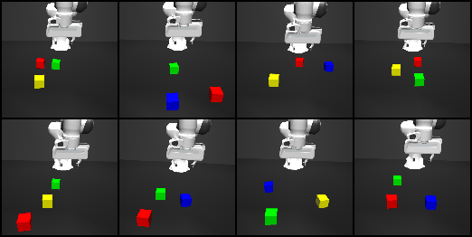

# Instructions for Training 3D Diffuser Actor with PEEK

## 🚀 Installation

### Setup the repository and conda env
```bash
git clone https://github.com/memmelma/problem_reduction.git
cd problem_reduction
git submodule update --init --recursive

conda create -n threedda python=3.10
conda activate threedda
pip install -e .
```

### Install diffuser actor (policy)
```bash
ROOT_DIR=$(pwd)
pip install torch==2.0.0 torchvision==0.15.1 torchaudio==2.0.1 --index-url https://download.pytorch.org/whl/cu118
pip install dgl==1.1.3+cu118 -f https://data.dgl.ai/wheels/cu118/repo.html
pip install diffusers==0.11.1 transformers==4.30.2 huggingface-hub==0.25.2
pip install openai openai-clip
# downgrade numpy to ensure diffusers compatiblity
pip install "numpy<2"

cd third_party/3d_diffuser_actor
pip install -e .
cd $ROOT_DIR
```

### Install robomimic (dataloader)
```bash
ROOT_DIR=$(pwd)
cd third_party/robomimic
pip install -e .
cd $ROOT_DIR
```

## 🧊 Cube Stacking Dataset



The dataset contains ~2.5k trajectories of cube stacking generated with motion planning. Each scene contains 3 cubes with unique colors sampled from ```{red, green, blue, yellow}``` with language instruction ```"put the {red, green, blue, yellow} cube on the {red, green, blue, yellow} cube"```.

Download the cube stacking dataset from [huggingface](https://huggingface.co/datasets/memmelma/peek_threedda/tree/main).


## 💪 Training Example
To train and evaluate your own policies, follow:
1. Start the [PEEK VLM](https://github.com/memmelma/peek_vlm/blob/main/README.md#server) server
2. The flags ```--obs_path``` and ```--obs_mask_w_path``` control path- and masking on the policy's RGB-D observations
3. (Optional) Pass ```--wandb_entity``` and ```--wandb_project``` to enable wandb logging for training and evaluation metrics

Usage:
```bash
python scripts/threedda/run_3dda.py --dataset peek_threedda/pick_and_place_2500_3_objs_va_vel_004_ee.hdf5 --obs_continuous_gripper --obs_path --obs_mask_w_path --server_ip_vlm http://localhost:8000 --num_epochs 1500 --name example
```

## 🙏 Acknowledgements
- [3d diffuser actor](https://github.com/nickgkan/3d_diffuser_actor)
- [mink](https://github.com/kevinzakka/mink)
- [robomimic](https://github.com/ARISE-Initiative/robomimic)
